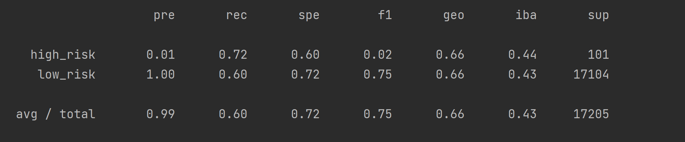
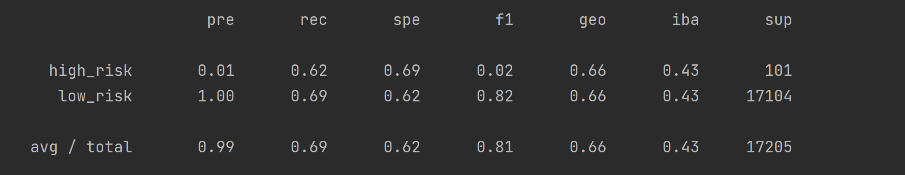
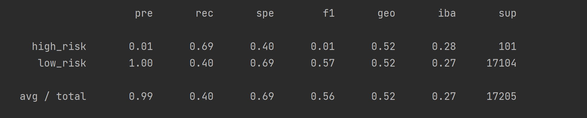
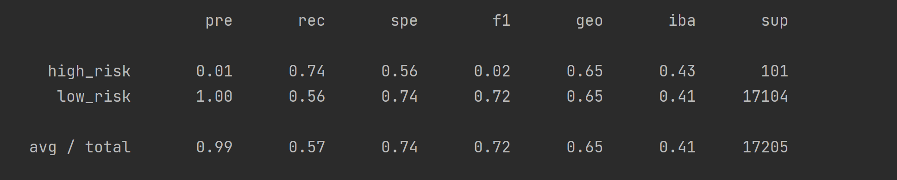
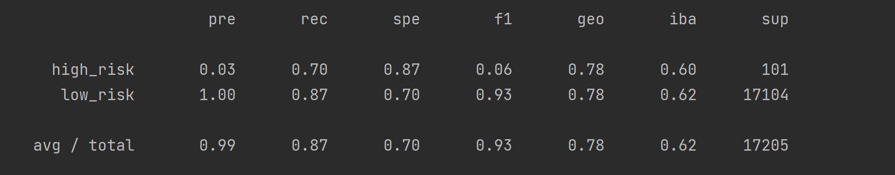

# Credit Risk Analysis
## Overview
Training machine learning models on loan data, predicting the risk associated with each loan, and evaluating the accuracy of each model against actual risk.

## Results
Below are the results for six machine learning models, all trained on the same set of data.
  
Each result displays an imbalanced classification report for the model with balanced accuracy score (geo), precision (pre), recall (rec), and F1 scores, along with each model's ranking among the six.

### Oversampling
* **Naive Random Oversampling**

  * _Balanced Accuracy Score_: **66% (T-3rd)**
  * _Precision_: **99% (T-1st)**
  * _Recall_: **60% (4th)**
  * _F1_: **75% (4th)**
  
  * _Overall Reliability_: **4th**
  
* **SMOTE**

  * _Balanced Accuracy Score_: **66% (T-3rd)**
  * _Precision_: **99% (T-1st)**
  * _Recall_: **69% (3rd)**
  * _F1_: **81% (3rd)**
  
  * _Overall Reliability_: **3rd**

### Undersampling
* **Cluster Centroids**

  * _Balanced Accuracy Score_: **52% (6th)**
  * _Precision_: **99% (T-1st)**
  * _Recall_: **40% (6th)**
  * _F1_: **56% (6th)**
  
  * _Overall Reliability_: **6th**

### Combination (Over & Under)
* **SMOTEENN**

  * _Balanced Accuracy Score_: **65% (5th)**
  * _Precision_: **99% (T-1st)**
  * _Recall_: **57% (5th)**
  * _F1_: **72% (5th)**
  
  * _Overall Reliability_: **5th**

### Ensemble Learning
* **Balanced Random Forest**

  * _Balanced Accuracy Score_: **78% (2nd)**
  * _Precision_: **99% (T-1st)**
  * _Recall_: **87% (2nd)**
  * _F1_: **93% (2nd)**
  
  * **Four Most Important Features**
    * _Loan Amount_ - **0.079**
    * _Interest Rate_ - **0.059**
    * _Installment Amount_ - **0.056**
    * _Annual Income_ - **0.054**
  
  * _Overall Reliability_: **2nd**

* **Easy Ensemble Adaboost**

  * _Balanced Accuracy Score_: **93% (1st)**
  * _Precision_: **99% (T-1st)**
  * _Recall_: **94% (1st)**
  * _F1_: **97% (1st)**
  
  * _Overall Reliability_: **1st** 

## Summary
Before breaking down the results, let's define each metric in the context
of our study:
* **Balanced Accuracy Score**
  * Raw score
  * What percentage of loans did the model correctly label?
* **Precision**
  * If the model tagged a loan as high-risk, what is the probability that it was _actually_ high-risk?
* **Recall (Sensitivity)**
  * Out of all the _actual_ high-risk loans, what percentage did the model correctly tag as high-risk?
    * In other words, how many of the high-risk loans was the model able to spot?
* **F1 Score**
  * How well-balanced are the model's precision and recall?
    * Is the test too quick to label a loan as high-risk, overestimating the total amount? (High Recall, Low Precision)
    * Or is the test too careful when labeling a loan as high-risk, and doesn't label enough of them? (Low Recall, High Precision)
  * Either case will result in a low F1 score.
  
### Recommendation
Upon review, it is clear the Easy Ensemble Adaboost method is the most reliable machine learning 
algorithm for this problem. It is sensitive enough to spot the majority of high-risk loans without overdoing it, 
and it is easily the most accurate by every other metric. However, while I believe it is the most reliable, 
I think the Balanced Random Forest model has appeal as well.
  
While less accurate than the Adaboost model, the Balanced RF algorithm is still more reliable than
the other four models, and can uniquely calculate which features best predict loan risk. In that
regard, it may offer more insight than the more exact Adaboost model, which could make it a better candidate,
depending on one's needs.
  
In the end, it's about the question at hand. If it were necessary to understand a few important factors
in determining loan risk, it would probably be worth it to sacrifice accuracy in favor of more accessible results. On the other hand,
if one needed a model to reliably assess loan risk based on a number of variables, I would highly recommend the Adaboost method.